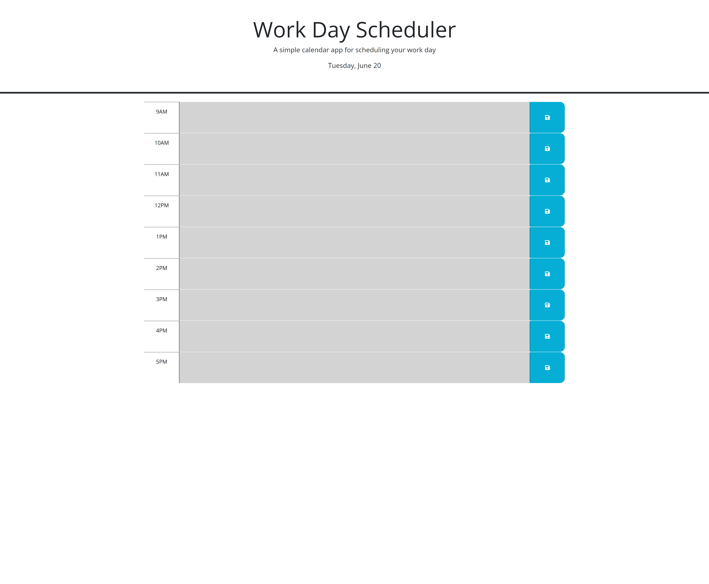

# Angelin_WorkDayScheduler

## Website Overview
    The web application named Work Day Scheduler is simple calendar application that allows user to save events for each hour of a typical day (9am-5pm). It helps the user store events to a daily planner, and informs user about past, present, and future events for the day which color coding the section.

## Website's Live URL - https://angelinrajan.github.io/Angelin_WorkDayScheduler/

## Functionality added to the starter code-
1. Today's date will be displayed within the header of the application.
2. Time Blocks for 9am - 5pm are displayed within the application with a row for each hour
3. Each hour is now color coded with past (grey), present (Red), or Future (Green) depending upon the time of the day user is looking at the scheduler. 
4. When events are entered within the scheduler for any timeblock and save button is clicked for its corresponding button, the event is saved to the browser storage.
5. When user closes and re-opens, or refreshes page, the saved items are correctly displayed in the corresponding time block.
6. When user removes an event and updates it with another event, the new event gets updated within storage and displayed in the application.

## Deployment steps-
1. Created a new repository within Github (included README file)
2. Copied the ssh url for cloning
3. Performed a git clone command followed by the copied ssh url in my local (VS code)
4. Pre-existing Assets folder, develop folder, script.js, style.css, and index.html files were copied into this repository
5. The index.html file was moved outside of the develop folder
6. Multiple commits and git push was done to keep repository up to date
7. Finally, deployment happened from Github by nativating to the repository/settings/pages and selecting main branch to deploy
8. The progress and the live website's url is displayed within the Actions tab
9. Clicking on the live website's link navigates user to the live website which is deployed without errors (See screenshot below)

## Outside source reference-
1. Learning about using dayjs for today's "now" date- https://zetcode.com/javascript/dayjs/
2. Learnt about dayjs display date format- https://day.js.org/docs/en/display/format
3. Researched on isafter - https://day.js.org/docs/en/query/is-after
4. Researched on local storage - https://blog.logrocket.com/localstorage-javascript-complete-guide/
5. Learnt about how to get current hour in dayjs - https://day.js.org/docs/en/get-set/hour
6. Learnt how to convert string into a number - https://gomakethings.com/converting-strings-to-numbers-with-vanilla-javascript/
7. Tutoring session with Jose Lopez